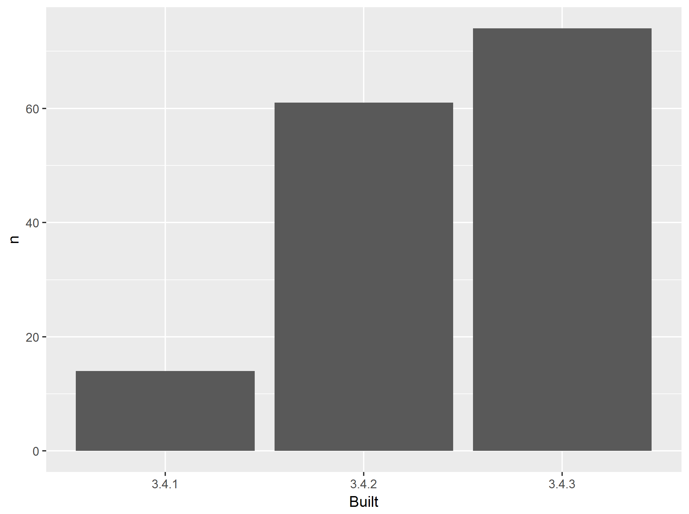

<!-- README.md is generated from README.Rmd. Please edit that file -->
packages-report
===============

Workshop challenge checklist
----------------------------

*As you complete tasks, you can ~~cross them out~~ by surrounding with `~~`.*

-   ~~Have a look around the files here. Where are the R scripts? What are the directories `data` and `figs` for?~~

-   ~~Notice that this README is an `.Rmd` file. That means it could contain R code and will need to be rendered to create `README.md`.~~

-   ~~Open [R/01\_write-installed-packages.R](R/01_write-installed-packages.R). Write the script as directed. Run it. Commit and push the current state.~~

-   ~~Open [R/02\_wrangle-packages.R](R/02_wrangle-packages.R). Fill in the missing pieces of the script as directed. Run it. Commit and push the current state.~~

-   ~~Open [R/03\_barchart-packages-built.R](R/03_barchart-packages-built.R). Fill in the missing pieces of the script as directed. Run it. Commit and push the current state.~~

-   ~~Fill in the blanks below in this README, using the results stored elsewhere.~~

-   If you get this far, write an R script to run the whole analysis and, perhaps, another script that does a `make clean` style reset.

Overview
--------

The goal of packages-report is to find the number of add-on packages installed, and determine which version of R they were built under.

I have 149 add-on packages installed.

Here's how they break down in terms of which version of R they were built under, which is related to how recently they were updated on CRAN.

    #> # A tibble: 3 x 3
    #>   Built     n   prop
    #>   <chr> <int>  <dbl>
    #> 1 3.4.1    14 0.0940
    #> 2 3.4.2    61 0.409 
    #> 3 3.4.3    74 0.497

### Flow of the analysis

*If you have time, document the analysis works, using internal links.*
